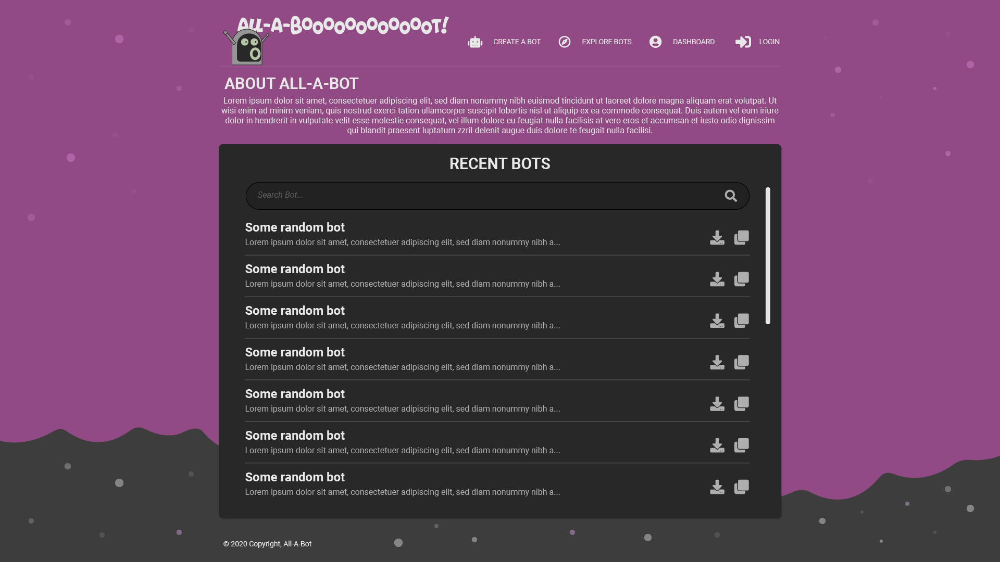
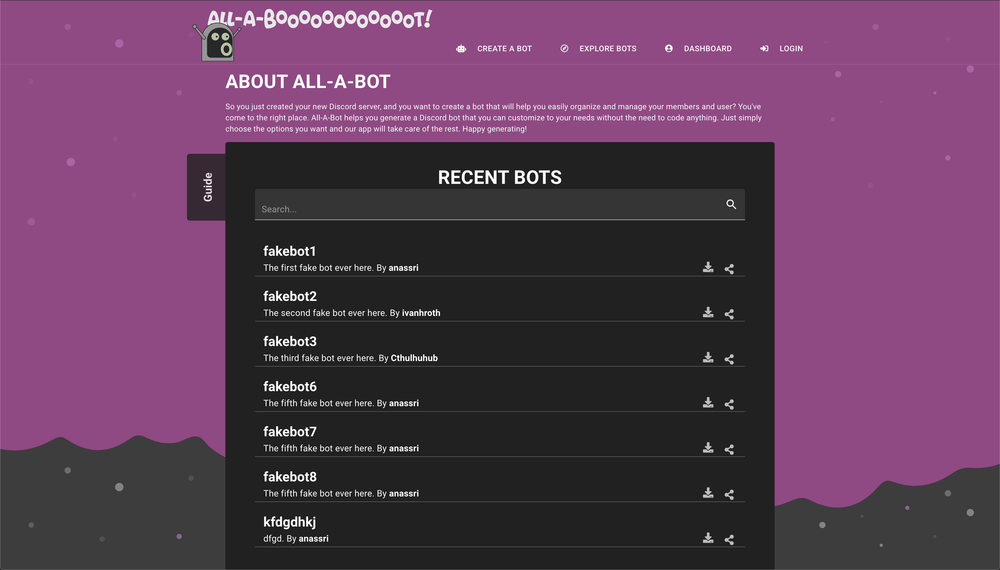

# All-A-Bot
*By Ammar Nassri, Ivan Roth, Matt Ramotar, Sam Holt - [Visit All-A-Bot](https://all-a-bot.herokuapp.com/)*

## Table of Contents:
* [All-A-Bot Summary](#All-A-Bot-summary)
* [Technologies Used](#technologies-used)
* [Frontend Overview](#frontend-overview)
* [Backend Overview](#backend-overview)
* [Next Steps](#next-steps)

## All-A-Bot Summary
All-A-Bot is a custom [Discord](https://discord.com/) bot generator. AAB is built to make it simple for Discord members to create bots, with multiple commands, for their Discord servers. Users will have to have a developer token acquired from Discord's website in order to be able to download bots from AAB.


## Technologies Used
All-A-Bot is a full-stack application built with a React frontend and an Python/Flask backend. Most of the logic happens in the React frontend. Incorporating [Material UI framework](https://material-ui.com/) for the styling.

The frontend is served by the backend, which responds to requests, and grabs data from the PostgreSQL database.

## Frontend Overview

All-A-Bot is a frontend heavy application. It utilizes React to create a dynamic and rich user experience. It also integrates with [DiscordJS](https://discord.js.org/#/), a Node.js module that allows for easiy interaction with the Discord API. Here are the technologies used to make this application.

### React

All-A-Bot is a React application. It utilizes its higher order components for a dynamic and efficient rendering. The app extensively uses the technologies and libraries of the React ecosystem.


In the Explore Bot page that displays all published bots, the app dynamically generates the list of bots that are fetched from the database. The code snippet below renders the list.

```js
{botsMatchingQuery.map((bot, i) => (
                <Box key={i}>
                  <ListItem
                    name={bot.name}
                    key={bot.id}
                    id={bot.id}
                    bot={bot}
                    description={bot.description}
                    username={bot.owner.username}
                    user={user}
                    bookmarkBotDispatch={bookmarkBotDispatch}
                    unbookmarkBotDispatch={unbookmarkBotDispatch}
                    loadBookmarksDispatch={loadBookmarksDispatch}
                    token={token}
                    style={{ textAlign: 'left' }}
                  />
                </Box>
))}
```

It uses the `botsMatchingQuery` variable that is saved to the local state to  re-render the list of bots in case the user searches for a particular bot. The component will rely on updates to the local state instead of firing off a new fetch request to the server everytime a user searches for a bot.

The code below shows what the `ListItem` component does:

```js
<Grid key={id} item xs={12} className={classes.bot}>
      <i
        onClick={handleBookmark(bot.id)}
        className={
          bookmarks ? (bookmarks.some(b => b.id === bot.id) ? 'fas fa-bookmark fa-2x' : 'far fa-bookmark fa-2x') : ''
        }></i>
      <CardActionArea className={classes.action}>
        <div className={classes.content}></div>
        <Link to={`/bots/${id}`} style={{ color: 'inherit' }}>
          <Typography variant='h5' component='h2' style={{ fontWeight: 'bold' }}>
            {name}
          </Typography>
          <Typography variant='subtitle1' component='h2'>
            <div>
              {description}. By <span style={{ fontWeight: 'bold' }}>{username}</span>
            </div>
          </Typography>
        </Link>
      </CardActionArea>
      <div className={classes.content}>
        <div>
          <DownloadBtn bot={bot} />
        </div>
        <i
          onClick={handleOpenPopover}
          title='Share a Bot'
          className='fas fa-share-alt fa-lg'
          style={{ cursor: 'pointer', opacity: 0.7 }}
        />
        <Popover
          open={popoverIsOpen}
          anchorEl={anchorEl}
          anchorOrigin={{ vertical: 'top', horizontal: 'right' }}
          transformOrigin={{ vertical: 'center', horizontal: 'center' }}
          anchorPosition={{ top: 10, right: 50 }}
          onClose={handleClosePopover}
          PaperProps={{ classes: { root: classes.popover } }}>
          <div>
            <EmailShareButton url={`https://all-a-bot.herokuapp.com/bots/${id}`}>
              <EmailIcon size={32} round={true} />
            </EmailShareButton>

            <FacebookShareButton url={`https://all-a-bot.herokuapp.com/bots/${id}`}>
              <FacebookIcon size={32} round={true} />
            </FacebookShareButton>

            <TwitterShareButton url={`https://all-a-bot.herokuapp.com/bots/${id}`}>
              <TwitterIcon size={32} round={true} />
            </TwitterShareButton>

            <LinkedinShareButton url={`https://all-a-bot.herokuapp.com/bots/${id}`}>
              <LinkedinIcon size={32} round={true} />
            </LinkedinShareButton>

            <RedditShareButton url={`https://all-a-bot.herokuapp.com/bots/${id}`}>
              <RedditIcon size={32} round={true} bgStyle={{ fill: '#F94503' }} />
            </RedditShareButton>
          </div>
        </Popover>
      </div>
    </Grid>
```
`ListItem` will destructure the props to use the information contained and insert them where they need to be in the list. All-A-Bot takes advantage of Material-UI's powerful components to display the bot information properly in thier corresponding layout.

In addition to viewing the bot information, the app lets the user edit and share the bot to different social media platforms.

### Redux

[Redux](https://redux.js.org/) and the [react-redux](https://react-redux.js.org/) were used to manage the application's state and make fetch requests to the backend.

Bots' information are fetched and kept in the Redux store. It provides a smoother experience once that load is complete. 

Redux paves the way for new features to be integrated easily.

### CSS & Material UI

All-A-Bot incorporates nicely with Material-UI. A mockup was created to determine the look and feel of the app before diving into developement. The app was designed to utilize Material-UI's components for a smoother look and nicer user experience.

#### Original Mockup


#### End Result


### DiscordJS
The [DiscordJS](https://discord.js.org/#/) Module is the heart of AAB. It integrates with our code to generate a template for the user to upload to discord. 

The code below checks which rule the user selected and generates the corresponding code accordingly.

```js
function commandObjectsBuilder(objList) {
    let commandObjects = ``

    objList.forEach(cmd => {
        const varName = cmd.trigger.details.string + '_' + randStringMaker()
        if (cmd.trigger.usesPrefix) {
            let objTemplate = `\n${varName} = {name: '${cmd.trigger.details.string}', async execute(message, args) {`
            cmd.response.forEach(res => {
                if (res.type === "message") {
                    objTemplate += `\n    ${basicResponseBuilder(res.details.string)}\n`
                } else if (res.type === "ban") {
                    objTemplate += `\n    ${banBuilder()}\n`
                } else if (res.type === "emoji") {
                    objTemplate += `\n    ${reactionBuilder(res.details.string)}\n`
                } else if (res.type === "assignRole") {
                    objTemplate += `\n    ${assignRoleBuilder()}`
                } else if (res.type === "removeRole") {
                    objTemplate += `\n    ${removeRoleBuilder()}`
                }
            })
            commandObjects += objTemplate + `}}\nclient.commands.set(${varName}.name, ${varName})\n`
        } else if (!cmd.trigger.usesPrefix) {
            let objTemplate = `\n${varName} = {name: \`${cmd.trigger.details.string}\`, async execute(message, args) {`
            cmd.response.forEach(res => {
                if (res.type === "message") {
                    objTemplate += `\n    ${basicResponseBuilder(res.details.string)}\n`
                } else if (res.type === "ban") {
                    objTemplate += `\n    ${banAuthorBuilder()}\n`
                }
            })
            commandObjects += objTemplate + `}}\nclient.commands.set(${varName}.name, ${varName})\n`
        } 
    })

    return commandObjects
}

```

Sample function that assigns a role:

```js
function assignRoleBuilder() {
    return `    let role = await message.guild.roles.cache.find(x => x.name === args[1]);
    if (!message.mentions.users.size) {
        return message.reply("you need to tag a user");
    }
    if (!role) {
        return message.reply("Role doesn't exist, either create that role or type a valid role");
    }
    const user = message.mentions.members.first()
    user.roles.add(role);
    message.reply(user.user.username + " is now a " + role.name);\n`
}
```

## Backend Overview
All-A-Bot uses a Python/Flask server with PostgreSQL as the database. The backend is fairly simple in comparison to the frontend. It sends the frontend to the client, receives requests and sends data to the frontend. Here is a breakdown of the backend technologies.

### Flask
[Flask](https://flask.palletsprojects.com/en/1.1.x/) was chosen as All-A-Bot's server-side framework for its minimalism. Flask makes it easier to integrate technologies such as [CSRF protection](https://owasp.org/www-community/attacks/csrf) without extra configuration. In addition, Flask integrates with SQLAlchemy, which makes querying data much simpler and more efficient.

### PostgreSQL
[PostgreSQL](https://www.postgresql.org/) is used as the project's database. Its simplicity and flexibility makes it an obvious choice amongst other SQL databases. 

## Next Steps
All-A-Bot is a living app. It will always have new features added to it to continue to improve it for best user experience. As DiscordJS continues to develop, AAB will have to adapt to include new rules and features that Discord members can use.

### Conclusion
All-A-Bot was developed specifically for us to try out something completely new. Most of us had no prior DiscordJS experience. It was fun working with a completely new module and getting to know the different things we can accomplish with DiscordJS.

